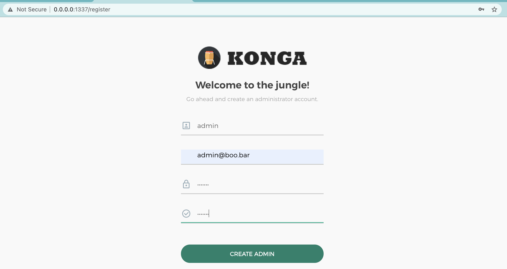
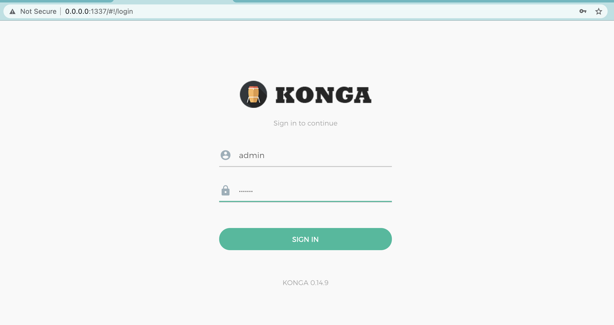
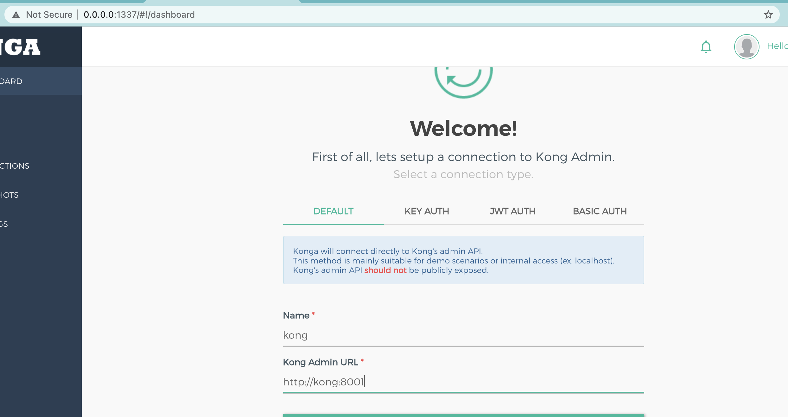

# Kongs lab

## API spec example
```
openapi: 3.0.0
info:
  title: Bookstore Api
  version: 0.0.1
  
servers: 
  - url: http://0.0.0.0:8080
  - url: http://jsonserver:8080

components:
  schemas:
    Book:
      properties:
        id:
          type: integer
          example: 2
        title: 
          type: string
          example: Dune
        author:
          type: string
          example: Frank Herbert
      required: [id, title, author]

paths:
  /books:
    post:
       summary: Create a book
       requestBody:
         content: 
           application/json:
             schema:
               $ref: '#/components/schemas/Book'
       responses:
         '201': 
           description: A JSON of the book that was created
           content: 
             application/json:
               schema:
                 $ref: '#/components/schemas/Book'
       tags: 
         - books
  
  
  /books/{id}:
     get:
       parameters:
          - name: id
            in: path
            description: Book ID
            required: true
            schema:
              type: integer
              example: 2
       summary: Return a list of books
       responses:
         '200': 
           description: A JSON array of books
           content: 
             application/json:
               schema:
                 type: array
                 items:
                   $ref: '#/components/schemas/Book'
       tags: 
         - books
   
     delete:
       parameters:
          - name: id
            in: path
            description: Book ID
            required: true
            schema:
              type: integer
              example: 2
       summary: Delete a book
       responses:
         '200':
           description: Status
       tags: 
         - books

```

## Intalation
- Add data for json server
    ```
    cat <<EOT > json-server/data/db.json
    {
        "books": [
            {
                "title": "The Mysterious Murder At Styles",
                "author": "Agatha Christie",
                "id": 1
            }
        ]
    }
    EOT
    ```

- Add Insomnia data
    ```
    cp -r ~/Library/Application\ Support/Insomnia insomnia-inso/data
    ```

- Build the images
    ```
    docker-compose build
    ```

- Run containers
    ```
    docker-compose up -d
    ```

- Set up konga

    

    

    

## Usage
- Create kong.yaml
  - get spec id
    ```
    docker-compose run --rm inso generate config
    ```
  - output config into file
    ```
    docker-compose run --rm inso generate config "copy id here" > kong/data/kong.yaml 
    ```

- Sync data into kong
    ```
    docker-compose exec kong bash
    ```
    ```
    cd app
    deck sync
    ```